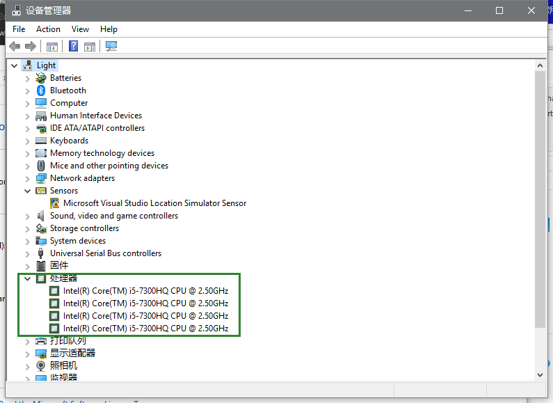

# 自己的一些理解
要理解并行，首先要知道什么处理器，比如我的电脑是四核的，如下图

这意味着我的电脑可以同时执行四个程序，可能有个疑问是有的电脑只有一个核也能
同时打开四个程序，这个其实不是真正的并行，原因可以用我们目前正在学的操作系
统来解答，我们的电脑是一个分时系统，看似我们同时运行着四个程序，但实际上这
四个程序在不停的切换(cpu的使用权)，因为切换的速度太快，我们人类感觉不出来，
就觉得是4个程序都同时在运行，但实际上任意时刻cpu只被一个程序所占有。

其实，不用了解上面的知识也能做并行计算，我希望用具体的例子来让你快速入门，
毕竟，我当时走了很多弯路（可能），当时看了很多书，现在发现，我看的50%以上
都是没用的或者说我们目前根本用不到的。那些东西其实看了也没什么，见多了便识广，
但是对于一个新手，是很低效的过程。并行计算，核心就是并行和计算，比如下面这个例子：

```c
    for(int i=1;i<=4000;i++){
        a[i] = b[i] + c[i]
    }
```
我们的任务是优化这一段代码，我们要怎么做呢？（假设我们的电脑有四个核）
    对，由于这一段代码所在的程序在一个线程上运行(一个程序通常由一个处理器运行)，
然而我们有四个核，我们可以用四个核来处理这个循环，第一个核处理1到1000，第二个核
处理1001到2000，第三个核处理2001到3000，第四个核处理3001到4000. 那么我们该怎么
使用这四个核呢？，或者说我们怎么把这四个任务分配到4个核上呢？  答案之一就是openmp(还有mpi,openacc等等)
openmp代码如下：
```c
    #pragma omp parallel for num_threads(4)
    for(int i=1;i<=4000;i++){
        a[i] = b[i] + c[i]
    }
```
与上面相比就多了一行代码
#pragma omp parallel for num_threads(4) 其中
```
parallel for 表示下面的内容是一个for循环
num_threads(4)表示将下面的for循环平均分给4个线程。
pragma 表示如果你的编译器不支持openmp，那么就忽略整个语句(#pragma omp parallel for num_threads(4))。
```

其实mpi也是差不多的，只不过mpi更加高级，比如我想让我的电脑和你的电脑一起
计算上面这段代码，那么我就需要使用mpi了，因为我们的电脑需要通过网络通知对方自己计算
的范围

其实到这里，你应该已经清楚并行计算是干什么的了，没错，就是你想象得那样---如何
使用一台电脑的多个核和多台电脑来计算(想想上面的循环)

## 关于比赛
对于比赛，我其实也学的不多
#### pac比赛（普通电脑上的比赛）
初赛题目是c++，由于不太懂c++ 的一些用法，我们学习
了c++ 的基础内容，然后将c++ 改为c，之后就使用openmp，当然没有上面的那么简单，
但是核心思想是一样的，把循环加载到多个核（也就是计组里面那个cpu）上运行，理论
上，如果单核的时间是10s，那么我用10个核时间就是1s。在openmp的基础上，我们还
使用了向量化(你可能没听过)，和一些乱七八糟的优化，时间从最开始的39s降到了1.4s。
我记得这个成绩已经很好了。 决赛就是，赛题不能使用openmp，我就通过分析程序结构(比
如有些操作是多余的，那么就可以去掉)，以及程序内部的一些参数的设置来优化程序，
还有很多其他的尝试，由于欠缺经验而最终失败，这也是和别人的差距,后面听了一些大佬的分享，才知道别人
是怎么做的。

#### cpc比赛（超级计算机上面的比赛）
这个比赛更多的就是文档的阅读了，
神威太湖之光是这个比赛的平台，它属于超算，虽然也用c语言写程序，但是程序运行的
方式完全不同与我们自己的电脑，因此需要参考着文档写代码。这个比赛相对简单，
只要进度够就能做的很好，今年我基本上是一个人写完了全部的代码，所以我的进度
非常不够，后面也没时间了

